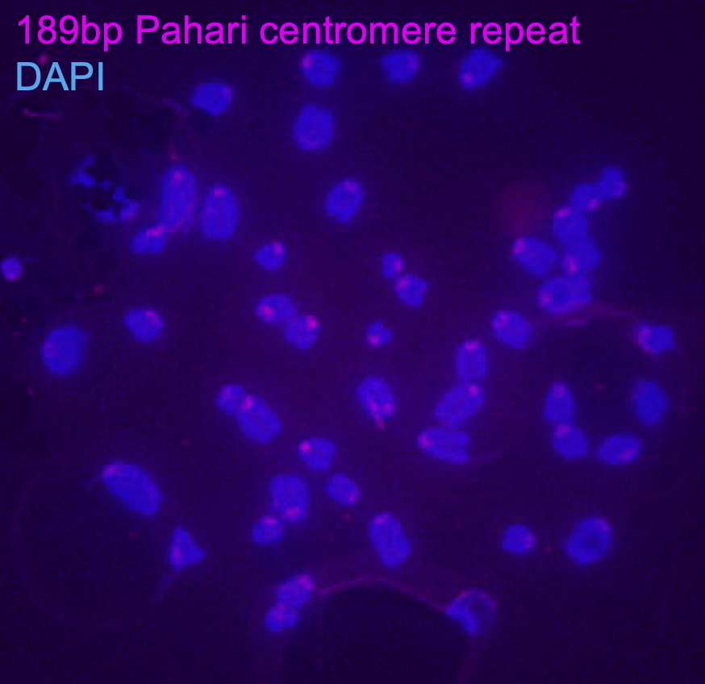

In performing the analysis to characterize the scope of variation at mouse centromeres, I wanted to investigate whether I could discover the previously unreported centromere repeat unit of the species Mus pahari. Taking the most frequent k-mers in this species, I assembled longer sequences that I hypothesized came from the centromere. I used the sequence constructed, synthesized probes, derived cell lines from Mus pahari, and tested my hypothesis using fluorescence in-situ hybridization.

This reconstructed sequecne was localized to the centromere! We shortly learned that scientists in Dr. Ben Black's lab at the University of Pennsylvania had also derived this sequence through CENP-A ChIP-seq in this species. Together, we forged a collaboration to dive into the evolutionary dynamics of Mus pahari centromeres. 

Skills: mammalian cell culture, mitotic cell spreads, fluorescence in-situ hybridization, reference independent analysis, customized k-mer based analysis, centromere biology, external collaboration, manuscript editing

[Publication](https://doi.org/10.1016/10.1126/sciadv.adi5764)

